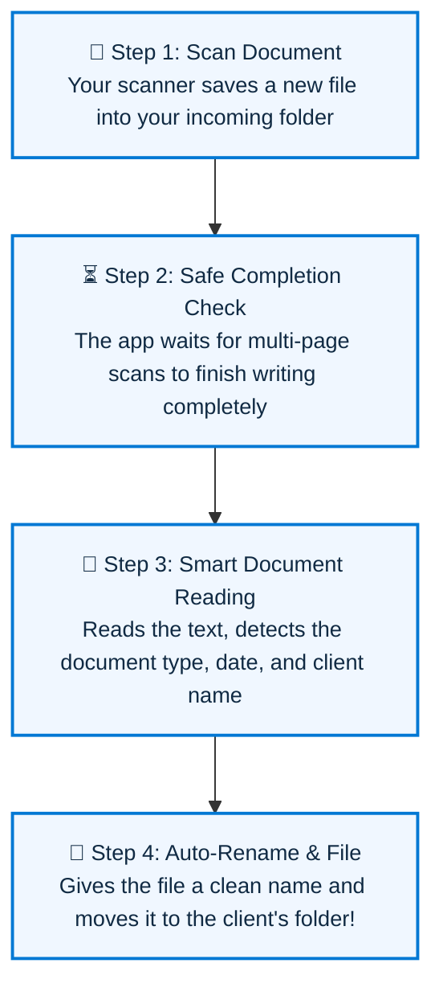
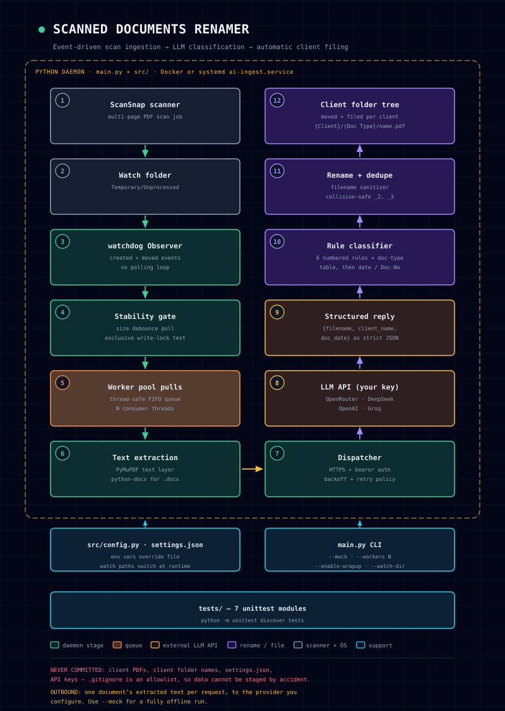

# 📁 Scanned Documents Renamer

**Point it at your scanner's output folder. It reads every new scan, figures out what document it is, renames it properly, and files it neatly under the right client.**

[](https://github.com/Lumi-nary/Scanned-Documents-Renamer/releases/download/v2.0.0/ScannedDocumentsRenamer_Setup_v2.0.0.exe)
[](docs/pipeline-flow.svg)
[](tests/)
[](LICENSE)

---

## 💡 What Does This App Do?

If your office scans invoices, tax documents, corporate certificates, receipts, or contracts all day, you probably know the pain of having an **`Unprocessed`** folder overflowing with useless filenames like `Scan_20260922_0001.pdf` or `20250912_0003.pdf`.

**Scanned Documents Renamer runs quietly in the background on your computer.** The moment your scanner finishes saving a new file, the app reads the document, figures out what it actually is, gives it a clear name, and moves it directly into the correct client's folder.

### 📋 Before & After Comparison

| ❌ What your scanner produces | ✅ What this app turns it into | Where it lands |
| :--- | :--- | :--- |
| `Scan_20260922_0001.pdf` | `Secretary's Certificate Doc. No. 387.pdf` | `📁 Clients / Acme Holdings Corp /` |
| `20250912_0003.pdf` | `BIR 2303 - Certificate of Registration.pdf` | `📁 Clients / Pacific Global Trade /` |
| `doc0049282026.pdf` | `Statement of Account 1185.pdf` | `📁 Clients / Sunrise Enterprises /` |
| `Scan_Batch_04.pdf` | `Summary of Services Rendered 09_15_2025.pdf` | `📁 Clients / Bright Future Corp /` |

---

## 🔄 How It Works (In 4 Simple Steps)

You don't need any technical knowledge to use this software. Here is the entire process from scanner to filing cabinet:



<br>

<div align="center">
  <a href="docs/pipeline-flow.svg">
    
  </a>
  <p><sub><em>Click the diagram above to view the full high-resolution visual flow map (<a href="docs/pipeline-flow.svg">docs/pipeline-flow.svg</a>).</em></sub></p>
</div>

### Step-by-Step Breakdown:
1. **Scan or Drop**: Your scanner (Fujitsu ScanSnap, Brother, Canon, HP, Ricoh, etc.) drops a PDF into your incoming scan folder.
2. **Safe Completion Check**: The app automatically waits until the scanner has 100% finished writing all pages. You'll never get a broken or half-copied file.
3. **Smart Document Reading**: The app inspects the text layer or visual scan. It checks who issued the document, what kind of document it is (e.g. Certificate, Tax Return, Invoice), and finds key identifiers like Document Numbers or dates.
4. **Instant Renaming & Filing**: The file is cleanly renamed and filed away in your organized client archive. If a file with that name already exists, it safely appends `_2.pdf` so nothing is ever overwritten.

---

## 🚀 Quickstart: How to Use the App (3 Easy Steps)

No programming or setup required! Just run the desktop app:

### 1. Download & Open
Download the Windows installer or portable standalone program:
- 📦 **[Download Windows Setup Installer v2.0.0 (.exe)](https://github.com/Lumi-nary/Scanned-Documents-Renamer/releases/download/v2.0.0/ScannedDocumentsRenamer_Setup_v2.0.0.exe)** (Recommended — creates desktop & start menu shortcuts)
- 🗂️ **Or run the portable version:** Open `dist/ScannedDocumentsRenamer/ScannedDocumentsRenamer.exe` directly from any folder or USB drive.

### 2. Choose Your Folders
In the desktop window:
- Click **"Browse..."** under **Scan Input Folder** and pick the folder your scanner saves files to (e.g., `C:\Scans\Incoming`).
- Click **"Browse..."** under **Client Documents Folder** and pick where you want organized folders to live (e.g., `C:\Company\Clients`).

### 3. Click "Start Watching"
Click the green **"Start Watching"** button. That's it! 
Now, whenever you scan a document or drag a PDF into your incoming folder, watch the live feed — it will automatically read, rename, and file it in seconds.

---

## ✨ Friendly Features Built for Your Office

### 📋 Customizable "Instructions" Tab
Every business has unique documents and naming preferences. With the **Instructions** tab, you can customize how different document types are recognized and named without touching a line of code!
- **10 Built-in Office Presets**: Pre-configured rules for Corporate Certificates, Statements of Account, Tax Returns, Identity Documents, Contracts, and more.
- **Add Your Own Document Types**: Click **"+ Add Document Type"**, type your document name (e.g., *"Lease Agreement"*), specify the naming pattern, and you're done.
- **Search & Filter**: Quickly find and review any document rule with the search bar.
- **Preview AI Instructions**: Click **"Preview Full AI Prompt"** to see exactly what instructions the AI will follow.

### 💾 Floating "Save Settings" Bar
Never lose your configuration! Whenever you make changes to folders, AI models, or instructions:
- An unmistakable **Floating Action Bar** pops up in the bottom-right corner showing: *"You have unsaved changes"*.
- Click **"Save Settings"** to instantly apply your changes, or click **"Discard"** to revert.
- The app even warns you if you try to switch tabs or close the window with unsaved changes.

### 👤 Active Client Context (Batch Scanning Mode)
- **Working on a single client today?** Select their name from the **Active Client** dropdown. Every document scanned during that session will route straight into that client's folder.
- **Scanning a mixed stack of documents?** Turn Active Client off (or set to *"Auto-Detect Only"*), and the AI will figure out the client for each individual document automatically.

### 🔒 100% Private & Offline Mode
- **Zero Document Leakage**: Your files never leave your computer unless you explicitly choose to connect an online AI provider.
- **Local Rule Engine**: Select **"Built-in Rules + Local OCR"** in Settings to run 100% offline with zero external API calls and $0.00 cost.
- **Git Security**: The repository includes strict security rules (`.gitignore` allowlist) ensuring client names, scanned PDFs, and local settings can never accidentally be committed or shared.

---

## 🤖 Supported AI Providers & Models

You can use the built-in free offline mode, or connect any modern AI provider for advanced visual document understanding:

| Provider | Internet Required? | Recommended Model | Best For | Typical Cost |
| :--- | :---: | :--- | :--- | :--- |
| **Built-in Rules (Offline)** | ❌ No (100% Offline) | `Built-in Rules + Local PP-OCR` | Standard office paperwork, maximum privacy | **$0.00 (Free)** |
| **OpenRouter** *(Recommended)* | 🌐 Yes | `qwen/qwen3-vl-32b-instruct` | Scans, receipts, stamps, skewed paperwork | ~$0.0001 / document |
| **DeepSeek** | 🌐 Yes | `deepseek-chat` / `deepseek-v4` | High-accuracy legal contracts & text reasoning | ~$0.0002 / document |
| **OpenAI** | 🌐 Yes | `gpt-4o-mini` | Direct OpenAI vision integration | ~$0.0005 / document |
| **Groq** | 🌐 Yes | `llama-3.1-8b-instant` | Near-instant millisecond classification | Ultra-low cost |
| **Ollama** | ❌ No (Local AI) | `llama3.2-vision` | Running your own AI models on your computer | **$0.00 (Free)** |

*Tip: You can switch providers at any time directly in the desktop **Settings** tab!*

---

## 🔧 Advanced & Developer Guide

*This section is for developers, system administrators, and IT professionals who wish to run from source, automate via command line, deploy with Docker, or run tests.*

### Running from Python Source
```bash
# 1. Clone the repository
git clone https://github.com/Lumi-nary/Scanned-Documents-Renamer.git
cd Scanned-Documents-Renamer

# 2. Install dependencies
pip install -r requirements.txt

# 3. Launch Desktop GUI
python app.py

# Or double-click the helper script:
"Run Scanned Documents Renamer.bat"
```

### Running Headless (CLI / Server Mode)
To run without a user interface (ideal for headless office servers, NAS systems, or background automation):
```bash
python main.py --watch-dir "C:/Scans/Incoming" --provider openrouter
```

### Command-Line Arguments (CLI)

| Flag | Description |
| :--- | :--- |
| `--gui` | Launch the PyWebView Desktop GUI window |
| `--watch-dir PATH` | Set or override the directory to monitor for new scans |
| `--output-dir PATH` | Set directory where AI response logs are written |
| `--provider NAME` | Choose AI provider (`native`, `openrouter`, `deepseek`, `openai`, `groq`, `ollama`) |
| `--mock` | Run full pipeline offline with mock data (dry run) |
| `--workers N` | Number of parallel worker threads (default: 2) |
| `--disable-active-client` | Disable client context inheritance; unassigned docs stay in staging |
| `--enable-wrapup` / `--disable-wrapup` | Enable or disable automatic batch wrap-up tracking |
| `--wrap-batch` | Force wrap-up and finalize the current batch on exit |
| `--wrap` | Send wrap-up signal to an actively running background daemon |
| `--batch-export PATH` | Export queued files as a JSONL batch-API manifest and exit |
| `--demo` | Run interactive demonstration of runtime watch-path swapping |

### Configuration via `settings.json` or Environment Variables
Settings can be defined in `settings.json` (created automatically by the GUI) or via environment variables (environment variables take precedence):

```json
{
  "watch_directories": ["./Temporary/Unprocessed"],
  "destination_directory": "./Clients",
  "provider": "openrouter",
  "model_name": "qwen/qwen3-vl-32b-instruct",
  "api_key": "YOUR_API_KEY_HERE",
  "num_workers": 2,
  "stability_timeout": 30,
  "active_client_context": true
}
```

```bash
export AI_API_KEY="your_api_key_here"
export AI_PROVIDER="openrouter"
export AI_MODEL="qwen/qwen3-vl-32b-instruct"
export WATCH_DIR="./Temporary/Unprocessed"
```

### Running the Test Suite
The project includes a comprehensive suite of **73 automated unit tests** covering the desktop bridge, watchdog file-system monitoring, file write-lock stability verification, AI dispatchers, rename rules, client routing, and instruction managers:

```bash
python -m unittest discover tests
```
*Expected output: `Ran 73 tests in ...s - OK`*

### Building Standalone Executable & Installer
To build the distribution executable and installer on Windows:
```bash
# 1. Build the standalone portable application folder in dist/:
python build_exe.py

# 2. Build the Windows Setup Installer wizard:
installer\build_installer.bat
```

### Docker & Linux Service Deployment
For Linux or Docker deployments:
```bash
# Docker Compose:
docker-compose up -d

# Or run as a systemd service:
# Install deployment/ai-ingest.service to /etc/systemd/system/
sudo systemctl enable --now ai-ingest.service
```

---

## 🛡️ Privacy & Security Commitment

- **Local First**: Files are never moved outside your local network unless you explicitly provide an API key for a cloud vision provider.
- **Zero Disk Exposure**: Only the specific document being classified is read. Directory listings, other client folders, and unrelated files are never accessed or transmitted.
- **Repository Safety**: The `.gitignore` is structured as a strict security allowlist. Client folders, scanned PDFs, Word documents, `.env` files, and `settings.json` can never be tracked by git.

---

## 📄 License

**PolyForm Noncommercial License 1.0.0** — see [LICENSE](LICENSE).

You may use, modify, and share this software for **any noncommercial purpose** (personal use, study, hobby projects, research, charities, schools, public research bodies, and non-profit institutions). You may **not** use it commercially, and you may **not** sell it or a modified version of it.

*Required Notice:* Copyright (c) 2026 Lumi-nary (<https://github.com/Lumi-nary>)
