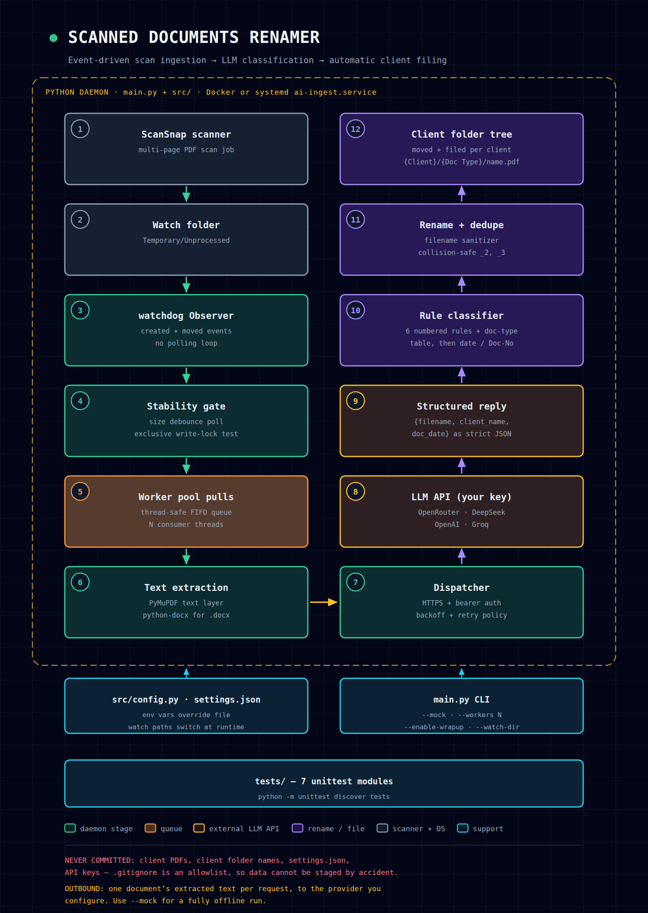

# Scanned Documents Renamer

**Point it at a scanner's output folder. It reads each new scan, works out what the document actually is, renames it properly, and files it under the right client.**

Built for offices that scan corporate, legal, tax and billing paperwork all day and lose half of it in a folder called `Unprocessed`. The pipeline is a background daemon: it watches, waits for each file to finish writing, sends the text to an LLM for classification, then applies deterministic rename rules and moves the file into a per-client folder.



<sub>Flow map: [`docs/pipeline-flow.svg`](docs/pipeline-flow.svg) (vector source)</sub>

---

## Why it exists

- **Scanning is fast, filing is slow.** The bottleneck is not the scanner, it is deciding what each page is and where it belongs.
- **Filenames matter.** A file named `20250912_0003.pdf` is invisible. `Secretary's Certificate Doc. No. 387.pdf` is searchable, and it lands in the right client folder automatically.
- **Nothing about your documents should leak into your repo.** `.gitignore` here is an allowlist: client folders, PDFs and `settings.json` cannot be staged, even by accident.

---

## How it works

1. **Scan** — your scanner drops a multi-page PDF into a watch folder (e.g. `Temporary/Unprocessed`).
2. **Observe** — `watchdog` fires on *created* and *moved* events. No polling loop.
3. **Verify** — a stability gate polls file size until it stops growing, then tests the write lock, so a half-copied scan is never processed.
4. **Queue** — validated paths go onto a thread-safe FIFO queue; producers never block on the network.
5. **Extract** — worker threads pull from the queue and pull text out of the document (PyMuPDF text layer for PDFs, `python-docx` for Word files).
6. **Classify** — the extracted text goes to the configured LLM with a strict prompt that returns one JSON object per document:
   ```json
   {"filename": "Secretary's Certificate Doc. No. 387.pdf",
    "client_name": "Example Holdings Corp",
    "doc_date": "09/12/2025"}
   ```
7. **Rename** — deterministic rules in `src/organizer.py` build the final filename (document type, Doc. No. when present, otherwise date), sanitize it, and resolve collisions as `name_2.pdf`, `name_3.pdf`.
8. **File** — the document moves into its client folder; with wrap-up enabled, a batch is closed out and `Clients.docx` is updated with the client's date range.

The LLM is used for *reading*, not for *file naming policy* — the naming rules are local, deterministic and testable, so the same input always produces the same filename.

---

## Rename & classification rules

`src/organizer.py` applies numbered rules before any model output is trusted:

| Rule | Document family |
| --- | --- |
| 1 | Liquidation of Deposit for Out-of-Pocket Expenses |
| 2 | Statement of Account / SOA / OPE — reduced to its reference digits (`OPE-1185` → `1185.pdf`) |
| 3 | Transmittal Sheet (requires an explicit header, so it cannot be matched by accident) |
| 4 | Summary of Services / Services Rendered |
| 5 | Certificates & registration documents (Certificate of Incorporation, Certificate of Registration, BIR 2303, Authority to Print, BIR 1901–1906, Secretary's Certificate, Certificate of Filing) |
| 6 | Tax returns & declarations (e.g. Documentary Stamp Tax declaration returns) |

Filenames follow the document, not the scan:

```
Secretary's Certificate Doc. No. 387.pdf     # Doc. No. found in the notary block
Secretary's Certificate 06_26_2025.pdf       # no Doc. No. -> first page date
OPE-1185.pdf -> 1185.pdf                     # reference-numbered documents
```

Client attribution prefers the corporate-officer pattern (`"...being the duly qualified Corporate Secretary of EXAMPLE HOLDINGS CORP."` → `Example Holdings Corp`), falls back to the active client, and normalizes names to Title Case.

---

## Providers

Any OpenAI-compatible endpoint. Presets in `src/config.py`:

| Preset | Base URL | Default model |
| --- | --- | --- |
| `openrouter` | `https://openrouter.ai/api/v1` | `google/gemini-2.5-flash:free` |
| `deepseek` | `https://api.deepseek.com/v1` | `deepseek-chat` |
| `openai` | `https://api.openai.com/v1` | `gpt-4o-mini` |
| `groq` | `https://api.groq.com/openai/v1` | `llama-3.1-8b-instant` |

The dispatcher adds bearer auth, a request timeout, and exponential backoff with capped retries.

---

---

## Dedicated Windows Desktop Application & Installer

For non-technical users and office staff who don't have Python installed:

[](https://github.com/Lumi-nary/Scanned-Documents-Renamer/raw/main/dist/installer/ScannedDocumentsRenamer_Setup_v1.0.0.exe)

- **Dedicated Windows Installer:** Download and run [ScannedDocumentsRenamer_Setup_v1.0.0.exe](https://github.com/Lumi-nary/Scanned-Documents-Renamer/raw/main/dist/installer/ScannedDocumentsRenamer_Setup_v1.0.0.exe) directly. It provides a full Windows setup wizard, creates Start Menu and Desktop shortcuts, and sets up a clean uninstaller.
- **Portable Mode:** Run `dist/ScannedDocumentsRenamer/ScannedDocumentsRenamer.exe` directly from any folder or USB drive without installing.
- **Native Windows folder dialogs:** Pick your scanner's destination folder visually with a standard "Browse..." button.
- **Visual Settings:** Configure AI providers (OpenRouter, DeepSeek, OpenAI, Groq, or Mock offline mode), models, and API keys without editing JSON files.
- **Live Ingestion Feed:** Watch documents being detected, read by AI Vision OCR, renamed, and organized in real time.
- **One-Click Explorer Access:** Click "Show in Folder" on any filed document to instantly reveal it in Windows Explorer.
- **Zero Configuration Required:** Includes a built-in Mock mode for testing without an API key.

### Building the Installer from Source

```bash
# 1. Compile the standalone executable:
python build_exe.py

# 2. Or compile the complete Windows Setup Installer:
installer\build_installer.bat
```

---

## Quickstart

### Option A: Setup Installer / Desktop App (No Python Required)
```bash
# Run the dedicated Windows installer wizard:
dist\installer\ScannedDocumentsRenamer_Setup_v1.0.0.exe

# Or run the portable standalone app:
dist\ScannedDocumentsRenamer\ScannedDocumentsRenamer.exe
```

### Option B: Run from Python Source
```bash
# Double-click "Run Scanned Documents Renamer.bat" or run:
python app.py
```

### Option C: Headless Command Line (For Servers & Automation)
```bash
git clone https://github.com/Lumi-nary/Scanned-Documents-Renamer.git
cd Scanned-Documents-Renamer
pip install -r requirements.txt        # watchdog, pymupdf, python-docx, pywebview
cp settings.example.json settings.json # or configure visually in the Desktop UI
python main.py
```

`settings.json` and environment variables are both honored (env wins):

```json
{
  "watch_directories": ["./Temporary/Unprocessed"],
  "provider": "openrouter",
  "model_name": "google/gemini-2.5-flash:free",
  "api_key": "YOUR_OPENROUTER_API_KEY_HERE",
  "num_workers": 2,
  "stability_timeout": 30
}
```

```bash
export AI_API_KEY="..."          # API key
export AI_PROVIDER="deepseek"    # preset name
export AI_MODEL="deepseek-chat"  # model override
export AI_BASE_URL="..."         # custom OpenAI-compatible endpoint
export WATCH_DIR="./Temporary/Unprocessed"
```

### CLI

| Flag | Purpose |
| --- | --- |
| `--gui` | Launch the PyWebView Desktop GUI |
| `--watch-dir PATH` | Add or override the directory to watch |
| `--output-dir PATH` | Where AI response files are written |
| `--provider NAME` | Provider preset (`openrouter`, `deepseek`, `openai`, `groq`) |
| `--mock` | Full pipeline, zero network calls — safe dry run |
| `--workers N` | Worker thread count (default 2) |
| `--enable-wrapup` / `--disable-wrapup` | Turn automatic batch wrap-up on/off |
| `--wrap-batch` | Force wrap-up of the current batch on exit |
| `--wrap` | Signal a running daemon to wrap up now |
| `--batch-export PATH` | Export queued files as a JSONL batch-API manifest and exit |
| `--demo` | Demonstrate runtime watch-path swapping |

### Tests

```bash
python -m unittest discover tests
```

Nine modules, 50 tests, all passing (`python -m unittest discover tests`): Desktop GUI bridge, daemon lifecycle, the queue and dispatcher behaviour, stability gate, rename and client-name rules, and end-to-end pipeline execution with synthesized documents.

### Deployment

```bash
docker-compose up -d
```

Or on a plain Linux host, use the bundled unit — `deployment/ai-ingest.service` — with `WorkingDirectory` pointed at the checkout and `AI_API_KEY` supplied through an environment file rather than inlined in the unit.

---

## Privacy & data handling

> **Nothing about your files is committed here.** `.gitignore` ignores *everything* at the repo root and whitelists only code, docs and templates. Client folders, scanned PDFs, `.docx` files, `settings.json`, `.env` and generated logs cannot be staged — so client names and documents never reach git history.

- **Outbound:** one document's extracted text per classification request, sent over HTTPS to the provider you configure with your own key. Nothing else is transmitted — no filenames from your disk, no folder listings, no telemetry.
- **Offline:** `python main.py --mock` runs the entire pipeline with no network calls.
- **Secrets:** the API key lives in `settings.json` or the environment. Keep it out of version control (already the default here) and use a revocable, spend-capped key.
- **Client data stays client data:** if a provider's data-retention policy is unacceptable for your documents, point `AI_BASE_URL` at a self-hosted OpenAI-compatible model, or run in mock mode.

---

## Design background

`Python AI Script Roadmap.txt` is the research write-up behind the architecture: OS file-system notification interfaces, debounce and lock-verification strategies, dynamic watch-path swapping, and the cost analysis that drove the model-provider choices.

---

## License

**PolyForm Noncommercial License 1.0.0** — see [LICENSE](LICENSE).

You may use, modify and share this software for **any noncommercial purpose** (personal use, study, hobby projects, research, and by charities, schools, public research bodies and government institutions). You may **not** use it commercially, and you may **not** sell it or a modified version of it.

Required Notice: Copyright (c) 2026 Lumi-nary (<https://github.com/Lumi-nary>)

This is a source-available license, not an OSI-approved open-source license — the restriction on commercial use is deliberate. If you redistribute a modified copy, you must pass these terms along with it.
